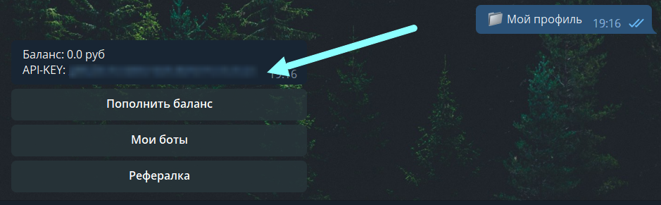
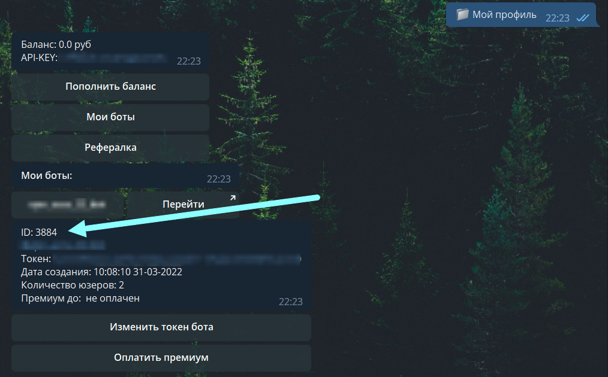

# Загрузка товаров

Начало гайда подразумевает, что вы имеете зарегистрированный магазин в @tippisell_bot.

##### Для начала узнаём id позиции 

<details>
  <summary>📚 Скриншоты</summary>


</details>


##### Переходим в @tippisell_bot и сохраняет api_key

<details>
    <summary>📚 Скриншоты</summary>


</details>


##### Получаем shop_id

<details>
  <summary>📚 Скриншоты</summary>


</details>


### Создаёт main.py файл с кодом: 

```python
import asyncio
from tippisell_api.clients.async_ import Client


shop_id = 1
api_key = "api_key"
product_id = 1


async def main():
    client = Client(shop_id, api_key)
    await client.upload_goods(product_id, ["test", "test", "test"])


loop = asyncio.get_event_loop()
loop.run_until_complete(main())
```

Присваиваем переменным ваши данные и запускаем 

И в ответ получаем 
```
3
```
